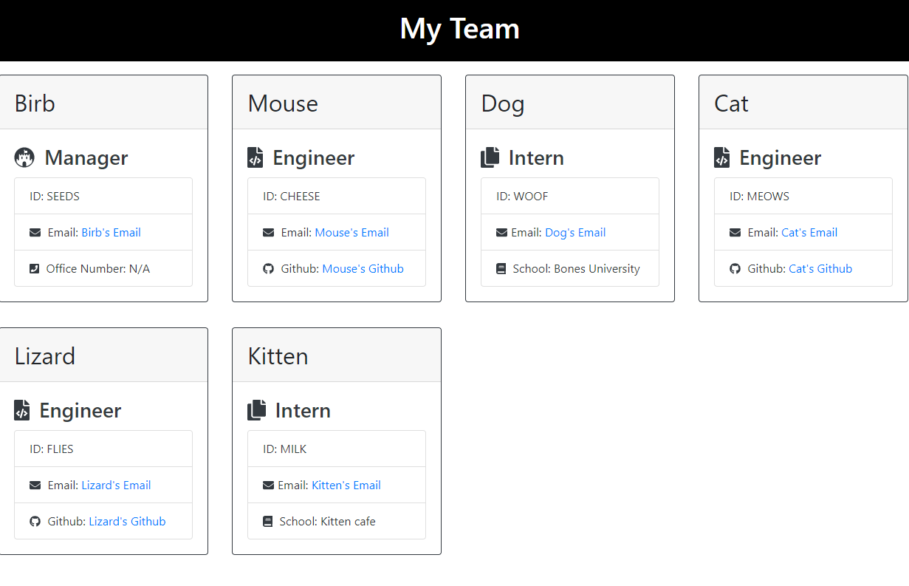

___
# Team Profile Generator

## Description

This was a team profile generator using Javascript, the Inquirer NPM , Node, and Jest for testing.

**Extra:**
Something that might not be immediately obvious are when giving the option of which role each employee gets, besides the manager, will unlock each own's respective secondary question.

I also added input validation to all my questions.

**Other:** I added clickability to all links and added extra icons for fun.


## Table of Contents 

* [License](#license)
* [Installation](#installation)
* [Usage](#usage)
* [Credits](#credits)


## License

[](https://opensource.org/licenses/BSD-2-Clause)

## Installation 

First star it. 
Then you could either fork it or download a zip file of it.
You should also have Node installed to your machine and the Inquirer npm.
You'll need to install Jest to test!

## Usage

Invoke the application with 

```node Index.js```

Then follow the question prompt in your terminal.

## Credits

I got help from the TAs and my tutor!

## How You Can Contribute

If you find issues open up an issue on the [original](https://github.com/cat-lin-morgan/team-profile-generator) repo.

## How You Can Test My Application

BREAK IT, I dare you.

## How You Can Reach Me

If you'd like to ask further questions you can reach me via [GitHub](https://github.com/cat-lin-morgan/) or email me at plummorgan@gmail.com!

## Video Walk-Thru and Screenshot

#### Video Walk-thru

[Click here to view my walk-thru of How to Use the Team Profile Generator.](https://drive.google.com/file/d/1Q8vp-1fZ7cg3OsTJbhGm62kSG7w4Rmwf/view?usp=sharing "Team Profile Generator")


[Click here to view my tests of the Profile Generator.](https://drive.google.com/file/d/1zvaBIbf9BjLQVp399r4ll_5ipmtcTfQi/view?usp=sharing "Testing theTeam Profile Generator")


#### Screenshot



___Thank you___

___
